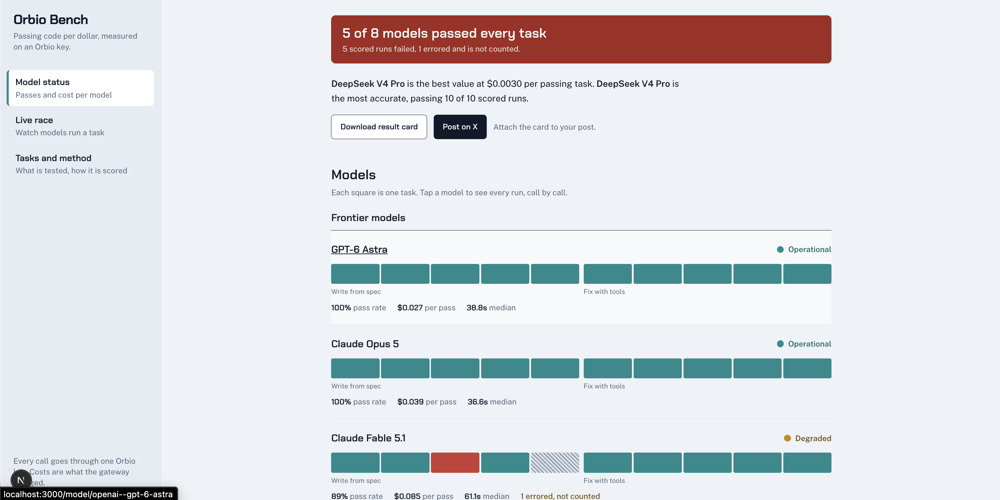
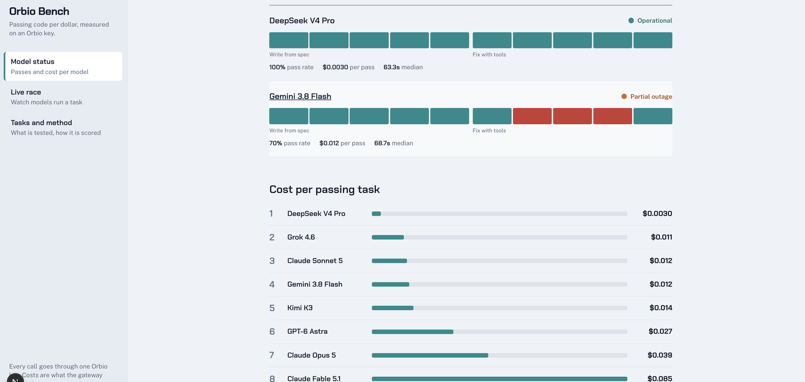
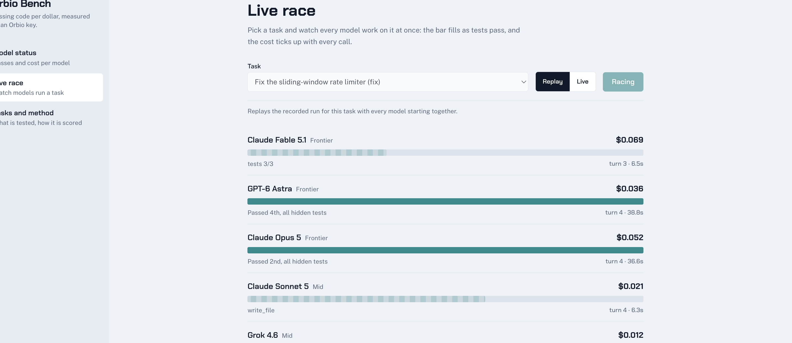
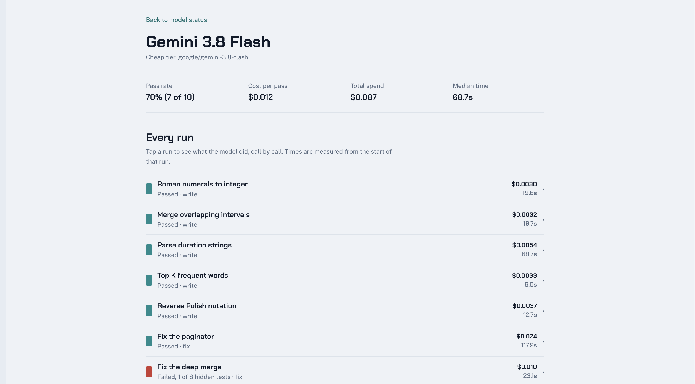

# Orbio Bench

**Which model gives you the most passing code per dollar on an Orbio key?**

Ten coding tasks (5 write-from-spec, 5 fix-the-bug with tools) run against 8 models through a single Orbio key.
Answers are graded on hidden tests, and every call is priced from the gateway's own response. The site is styled
as a status page: one bar per model, a cost-per-pass ranking, an incident list, a live race, and a share card
for social posts.

| Page | What it shows |
| --- | --- |
| `/` | Status board: pass rate, cost per pass and status for each model |
| `/model/[slug]` | One model and every run it made |
| `/tasks` | The ten tasks and the method |
| `/race` | Replay (or live) race of the models on one task |
| `/card` | 1200x630 share card, also used as the Open Graph image |

## Screenshots

### Model status board (`/`)

One square per task for each model (green passed, red failed, hatched errored and not counted), with pass rate, cost
per pass and median time underneath. The banner at the top summarises the run, and the result card can be downloaded
or posted on X.



Further down, models are ranked by cost per passing task.



### Live race (`/race`)

Pick a task and watch every model work on it at once. The bar fills as tests pass and the cost ticks up with every
call. Replay mode plays back the recorded run; Live mode makes real calls and needs `RACE_TOKEN`.



### Model detail (`/model/[slug]`)

Pass rate, cost per pass, total spend and median time for one model, followed by every run it made. Tap a run to see
what the model did, call by call.



## Quick start (no API key needed)

The repo ships with real benchmark results in `data/results.json`, so you can see the site without spending anything.

```bash
git clone <this-repo-url>
cd orbio-bench
npm install
npm run dev          # http://localhost:3000
```

Requires Node.js 20.12 or newer (`node -v`).

To check the project before a review or a deploy:

```bash
npm run typecheck      # TypeScript, no emit
npm run verify-tasks   # every task's reference solution passes, every starter fails
npm run build          # production build
```

## Re-running the benchmark

You need an Orbio key (claim one via the Orbio MCP: `orbio_claim_key`).

```bash
cp .env.example .env.local           # then put your key in ORBIO_API_KEY
npm run bench fix-csv-line eval-rpn  # cheap spot check of the key and model ids
npm run bench                        # full run
```

`npm run bench` resumes: it keeps every run that succeeded and only does what is missing or errored, so re-running
after a failure costs only the failed runs. It stops when total spend reaches `BENCH_BUDGET_USD`. If the key runs
out of credit (HTTP 401, 402 or 403) it stops at once, records nothing for the rejected runs, and exits with an
error, so a billing problem is never mislabelled as a model failure.

| Command | Effect |
| --- | --- |
| `npm run bench` | Resume: run only missing or errored runs |
| `npm run bench <taskId> ...` | Limit the run to those tasks |
| `npm run bench -- --fresh` | Throw away existing runs (for the named tasks, or all) and redo them |
| `npm run bench:mock` | Write simulated demo data. The site labels it as demo data everywhere. Refuses to overwrite real results |

### Environment variables

Copy `.env.example` to `.env.local`. `.env.local` is git-ignored.

| Variable | Default | Purpose |
| --- | --- | --- |
| `ORBIO_API_KEY` | none | Your Orbio key. Required for `bench` and live races. Never commit it |
| `ORBIO_BASE_URL` | `https://api.orbio.so/api/v1` | Gateway endpoint |
| `BENCH_BUDGET_USD` | `8` | `bench` stops once spend passes this |
| `BENCH_CONCURRENCY` | `4` | Parallel runs. Lower it if you see HTTP 429 |
| `RACE_TOKEN` | empty | Enables live races on the site. Leave empty for a replay-only public site |
| `LIVE_BUDGET_USD` | `1` | Spend cap for one live race |
| `NEXT_PUBLIC_SITE_URL` | `http://localhost:3000` | Public URL, used for share cards and the sitemap |

## What the status labels mean

| Status | Rule |
| --- | --- |
| Operational | Every task passed |
| Degraded | 80% or more passed |
| Partial outage | 50% to 79% passed |
| Major outage | Under 50% passed |
| Incomplete | Everything scored passed, but some runs errored (errors are excluded from the pass rate) |

## How it works

- `src/lib/orbio.ts` calls `ORBIO_BASE_URL/chat/completions` with tool calling. Cost comes from `usage.cost` in the
  response, then the model list's prices, then `n/a`. It never guesses.
- `src/lib/runner.ts` runs one model on one task. Coding tasks get one shot. Agentic tasks get `read_file`,
  `write_file`, `run_tests`, `submit` and 8 turns.
- `src/lib/sandbox.ts` runs model code in a separate Node process with a timeout, a memory cap and an empty
  environment, so the key is never visible to it.
- `src/lib/tasks.ts` defines the ten tasks with visible tests, hidden tests and a reference solution.
- `src/lib/models.ts` is the list of models. Edit it to benchmark any id your key can call.
- `src/app/api/race/route.ts` streams the race. Replay reads recorded events. Live needs `RACE_TOKEN`, allows one
  race at a time and one a minute, is capped by `LIVE_BUDGET_USD`, and stops if the viewer disconnects.
- `src/app/card/route.tsx` renders the share card.

```
scripts/     bench.ts, verify-tasks.ts   CLI entry points
src/app/     Next.js App Router pages and API routes
src/lib/     Benchmark engine: tasks, models, runner, sandbox, pricing
src/components/  UI components
data/results.json   Recorded benchmark results (committed, read by the site at runtime)
```

## Deploy

1. Run the benchmark locally and commit `data/results.json`.
2. Set `NEXT_PUBLIC_SITE_URL` to the public URL. Leave `RACE_TOKEN` empty so the public site is replay-only.
3. Deploy (Vercel works as is: import the repo, add `NEXT_PUBLIC_SITE_URL`, deploy).
4. Open `/`, `/race` and `/card` to confirm the data file shipped.

Never set `ORBIO_API_KEY` on a public deployment unless you also set `RACE_TOKEN` and accept live spend.

## Known limits

- The sandbox is process isolation, not a container. Fine for a benchmark you run yourself. Put a container behind
  `runHarness` before enabling live races for the public.
- Coding tasks accept a missing `module.exports` line and add it; the logic still has to be right.
- Fonts load from Google Fonts at runtime. Self-host them with `next/font` if you need to avoid that request.
- One recorded run errored: Claude Fable 5.1 on `eval-rpn` returned an empty completion from the gateway on every retry.
  It is shown as an error and excluded from that model's pass rate.
- Ten tasks is a small sample. Read the pass rates as a signal, not a leaderboard.
